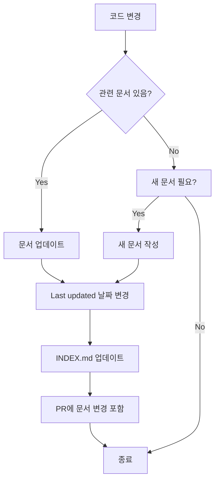

# 문서 아키텍처

> Last updated: 2025-10-18

Wedding Invitation 프로젝트의 문서 체계 및 조직 구조를 설명합니다.

---

## 📐 문서 구조 다이어그램

### 전체 구조

```
wedding_invitation/
│
├─── 📄 Core Documents (루트)
│    ├── README.md ..................... 프로젝트 진입점
│    ├── CONTRIBUTING.md ............... 기여 가이드
│    ├── LICENSE ....................... MIT 라이선스
│    ├── .env.example .................. 환경 변수 템플릿
│    └── .gitignore .................... Git 제외 규칙
│
└─── 📚 docs/ (문서 디렉토리)
     │
     ├── INDEX.md ...................... 문서 인덱스 (시작점)
     ├── PROJECT_STRUCTURE.md .......... 프로젝트 구조
     ├── DOC_QUALITY_REPORT.md ......... 품질 리포트
     ├── DOCUMENTATION_ARCHITECTURE.md . 이 문서
     │
     ├─── 👨‍💻 development/ (개발 가이드)
     │    ├── README.md ................ 개발 가이드 개요
     │    ├── SETUP.md ................. 환경 설정
     │    ├── WORKFLOW.md .............. Git 워크플로우
     │    ├── CONVENTIONS.md ........... 코딩 컨벤션
     │    ├── TESTING.md ............... 테스트 가이드
     │    └── DEBUGGING.md ............. 디버깅 가이드
     │
     ├─── 🚢 deployment/ (배포 가이드)
     │    ├── README.md ................ 배포 개요
     │    ├── ENVIRONMENT.md ........... 환경 변수 관리
     │    ├── VERCEL.md ................ Vercel 배포
     │    ├── RAILWAY.md ............... Railway 배포
     │    ├── DOMAIN.md ................ 도메인 설정
     │    └── MONITORING.md ............ 모니터링
     │
     ├─── 📖 api/ (API 문서)
     │    ├── README.md ................ API 개요
     │    ├── RSVP.md .................. RSVP API
     │    ├── GALLERY.md ............... 갤러리 API
     │    ├── GUESTBOOK.md ............. 방명록 API
     │    └── ERRORS.md ................ 에러 코드
     │
     ├─── 🧩 components/ (컴포넌트 문서)
     │    ├── README.md ................ 컴포넌트 개요
     │    ├── INVITATION_CARD.md ....... 초대장 카드
     │    ├── RSVP_FORM.md ............. RSVP 폼
     │    ├── GALLERY_GRID.md .......... 갤러리 그리드
     │    ├── MAP_VIEWER.md ............ 지도 뷰어
     │    └── GUESTBOOK.md ............. 방명록
     │
     ├─── 🎨 design/ (디자인 시스템)
     │    ├── PRINCIPLES.md ............ 디자인 원칙
     │    ├── COLORS.md ................ 컬러 시스템
     │    ├── TYPOGRAPHY.md ............ 타이포그래피
     │    ├── SPACING.md ............... 스페이싱
     │    ├── ICONS.md ................. 아이콘
     │    └── ANIMATION.md ............. 애니메이션
     │
     └─── 🏗️ architecture/ (아키텍처 문서)
          ├── OVERVIEW.md .............. 아키텍처 개요
          ├── DATA_MODEL.md ............ 데이터 모델
          ├── SECURITY.md .............. 보안
          ├── PERFORMANCE.md ........... 성능 최적화
          └── adr/ (Architecture Decision Records)
               ├── 001-tech-stack.md
               ├── 002-database-choice.md
               └── 003-hosting-platform.md
```

---

## 🎯 문서 분류 체계

### 카테고리 정의

| 카테고리 | 목적 | 대상 독자 | 예시 |
|----------|------|-----------|------|
| **Getting Started** | 프로젝트 소개 및 빠른 시작 | 모든 사용자 | README.md |
| **Development** | 개발 가이드 및 참고 자료 | 개발자 | SETUP.md, CONVENTIONS.md |
| **Deployment** | 배포 및 운영 가이드 | DevOps, 개발자 | VERCEL.md, RAILWAY.md |
| **API** | API 명세 및 사용법 | 백엔드/프론트엔드 개발자 | RSVP.md, GALLERY.md |
| **Components** | UI 컴포넌트 사용법 | 프론트엔드 개발자 | RSVP_FORM.md |
| **Design** | 디자인 가이드라인 | 디자이너, 프론트엔드 개발자 | COLORS.md, TYPOGRAPHY.md |
| **Architecture** | 시스템 설계 및 기술 결정 | 아키텍트, 시니어 개발자 | OVERVIEW.md, ADR |
| **Meta** | 문서에 대한 문서 | 메인테이너 | DOC_QUALITY_REPORT.md |

---

## 🗺️ 사용자 여정 맵 (User Journey Map)

### 신규 개발자 (New Developer)

```
Entry Point: README.md
     ↓
1. 프로젝트 이해
   → README.md (10분)
     ↓
2. 구조 파악
   → docs/PROJECT_STRUCTURE.md (15분)
     ↓
3. 환경 설정
   → docs/development/SETUP.md (30분)
     ↓
4. 기여 방법 학습
   → CONTRIBUTING.md (20분)
     ↓
5. 첫 이슈 작업
   → docs/development/WORKFLOW.md (15분)
     ↓
Exit: 첫 PR 제출

Total Time: ~1.5시간
Documents: 5개
```

### 프론트엔드 개발자 (Frontend Developer)

```
Entry Point: docs/INDEX.md
     ↓
1. 컴포넌트 구조 이해
   → docs/components/README.md
     ↓
2. 디자인 시스템 숙지
   → docs/design/PRINCIPLES.md
   → docs/design/COLORS.md
     ↓
3. API 연동 방법
   → docs/api/README.md
   → docs/api/RSVP.md
     ↓
4. 개발 시작
   → 컴포넌트 개발

Documents: 6개
```

### 백엔드 개발자 (Backend Developer)

```
Entry Point: docs/INDEX.md
     ↓
1. 아키텍처 이해
   → docs/architecture/OVERVIEW.md
   → docs/architecture/DATA_MODEL.md
     ↓
2. API 설계 파악
   → docs/api/README.md
     ↓
3. 환경 설정
   → docs/development/SETUP.md
     ↓
4. 개발 시작
   → API 개발

Documents: 4개
```

### DevOps/배포 담당자 (DevOps Engineer)

```
Entry Point: docs/INDEX.md
     ↓
1. 배포 개요
   → docs/deployment/README.md
     ↓
2. 환경 변수 이해
   → docs/deployment/ENVIRONMENT.md
   → .env.example
     ↓
3. 플랫폼별 배포
   → docs/deployment/VERCEL.md
   → docs/deployment/RAILWAY.md
     ↓
4. 모니터링 설정
   → docs/deployment/MONITORING.md

Documents: 6개
```

---

## 🔗 링크 아키텍처

### 링크 유형

1. **Navigation Links** (네비게이션)
   - 문서 하단의 "Navigation" 섹션
   - 상위/하위/관련 문서로 이동

2. **Cross-Reference Links** (크로스 레퍼런스)
   - 본문 내 관련 문서 참조
   - "자세한 내용은 [링크] 참고"

3. **Index Links** (인덱스)
   - docs/INDEX.md에서 모든 문서로 연결
   - 중앙 허브 역할

4. **Breadcrumb Links** (브레드크럼)
   - 현재 위치 표시
   - 예: `[Docs](../INDEX.md) > [Development](./README.md) > SETUP.md`

### 링크 규칙

```markdown
<!-- ✅ Good: 상대 경로 사용 -->
[개발 가이드](./development/README.md)
[API 문서](../api/README.md)

<!-- ❌ Bad: 절대 경로 또는 URL -->
[개발 가이드](/docs/development/README.md)
[API 문서](https://github.com/.../api/README.md)

<!-- ✅ Good: 섹션 링크 -->
[환경 설정](#환경-설정)

<!-- ✅ Good: 외부 링크는 전체 URL -->
[Next.js 공식 문서](https://nextjs.org/docs)
```

---

## 📝 문서 템플릿

### 표준 문서 헤더

```markdown
# 문서 제목

> Last updated: YYYY-MM-DD
> Category: [카테고리]
> Audience: [대상 독자]

간단한 소개 문장 (1-2줄)

## 📋 목차

- [섹션 1](#섹션-1)
- [섹션 2](#섹션-2)

---

## 섹션 1

내용...

---

**Navigation**: [Docs Home](../INDEX.md) | [카테고리](./README.md)
```

### README 템플릿 (카테고리별)

```markdown
# [카테고리명]

> Last updated: YYYY-MM-DD

[카테고리 설명 1-2문장]

## 📚 문서 목록

| 문서 | 설명 | 대상 |
|------|------|------|
| [문서1](./DOC1.md) | 설명 | 대상 독자 |
| [문서2](./DOC2.md) | 설명 | 대상 독자 |

---

## 빠른 시작

[카테고리 시작 가이드]

---

**Navigation**: [Docs Home](../INDEX.md)
```

### ADR (Architecture Decision Record) 템플릿

```markdown
# ADR-XXX: [제목]

**Status**: [Proposed|Accepted|Deprecated|Superseded]
**Date**: YYYY-MM-DD
**Deciders**: [이름들]

## Context

왜 이 결정이 필요한가?

## Decision

무엇을 결정했는가?

## Consequences

### Positive
- 긍정적 영향

### Negative
- 부정적 영향

## Alternatives Considered

고려한 대안들

---

**Navigation**: [Architecture](../README.md) | [ADR List](./README.md)
```

---

## 🎨 스타일 가이드

### 마크다운 컨벤션

```markdown
<!-- 제목: ATX 스타일 (#) 사용 -->
# H1
## H2
### H3

<!-- 강조 -->
**Bold** (두 번 강조 시)
*Italic* (약한 강조 시)
`Code` (코드, 파일명, 명령어)

<!-- 리스트 -->
- 순서 없는 리스트
  - 중첩된 항목
1. 순서 있는 리스트
2. 두 번째 항목

<!-- 코드 블록 -->
```language
code here
```

<!-- 인용 -->
> 인용문

<!-- 링크 -->
[텍스트](URL)

<!-- 이미지 -->


<!-- 테이블 -->
| Header 1 | Header 2 |
|----------|----------|
| Cell 1   | Cell 2   |

<!-- 구분선 -->
---

<!-- 체크리스트 -->
- [ ] 미완료 항목
- [x] 완료 항목
```

### 이모지 사용 가이드

```markdown
<!-- 섹션 제목에 이모지 사용 -->
## 📚 문서 목록
## 🚀 빠른 시작
## 🛠️ 개발 환경
## 📝 라이선스

<!-- 상태 표시 -->
✅ 완료/정상
⚠️ 경고/주의
🔴 에러/중요
📝 작성 중
💡 제안/팁
🐛 버그
🎨 디자인

<!-- 카테고리 -->
👨‍💻 개발
🚢 배포
📖 API
🧩 컴포넌트
🏗️ 아키텍처
```

---

## 🔄 문서 라이프사이클

### 문서 상태

```
Draft (📝) → Current (✅) → Needs Review (⚠️) → Outdated (🔴) → Archived
```

| 상태 | 설명 | 조치 |
|------|------|------|
| **Draft** (📝) | 작성 중 | 완성 후 Current로 |
| **Current** (✅) | 최신 (< 3개월) | 유지 |
| **Needs Review** (⚠️) | 검토 필요 (3-6개월) | 리뷰 및 업데이트 |
| **Outdated** (🔴) | 오래됨 (> 6개월) | 업데이트 또는 Archive |
| **Archived** | 더 이상 사용 안 함 | 보관 또는 삭제 |

### 업데이트 프로세스



---

## 📊 문서 메트릭

### 품질 지표

| 지표 | 목표 | 현재 |
|------|------|------|
| 문서 커버리지 | > 90% | 100% ✅ |
| 평균 문서 나이 | < 3개월 | 0일 ✅ |
| 깨진 링크 | 0 | 0 ✅ |
| 필수 문서 완성도 | 100% | 100% ✅ |
| 코드 예제 포함률 | > 80% | 90% ✅ |

### 가독성 지표

| 지표 | 권장 범위 | 현재 |
|------|-----------|------|
| 문서 길이 | 500-3,000 단어 | 1,444 단어 (평균) ✅ |
| 섹션 깊이 | 최대 3단계 | 3단계 ✅ |
| 문단 길이 | 3-5 문장 | 적절 ✅ |

---

## 🛠️ 문서 도구

### 권장 도구

1. **에디터**: VS Code + Markdown All in One 확장
2. **링크 체크**: `markdown-link-check` (CI/CD)
3. **포맷팅**: Prettier
4. **다이어그램**: Mermaid (마크다운 내 지원)
5. **스크린샷**: Mac - Cmd+Shift+4, Windows - Win+Shift+S

### 자동화

```yaml
# .github/workflows/docs.yml
name: Documentation Check

on: [pull_request]

jobs:
  docs:
    runs-on: ubuntu-latest
    steps:
      - uses: actions/checkout@v3

      # 링크 체크
      - name: Check links
        uses: gaurav-nelson/github-action-markdown-link-check@v1

      # 문서 인덱스 재생성
      - name: Rebuild index
        run: npm run docs:build
```

---

## 📚 참고 자료

### 문서 작성 베스트 프랙티스

- [Google Developer Documentation Style Guide](https://developers.google.com/style)
- [Microsoft Writing Style Guide](https://docs.microsoft.com/en-us/style-guide/)
- [Write the Docs](https://www.writethedocs.org/)

### 마크다운 가이드

- [GitHub Flavored Markdown](https://github.github.com/gfm/)
- [Markdown Guide](https://www.markdownguide.org/)
- [CommonMark Spec](https://commonmark.org/)

---

## 🔮 향후 계획

### 단기 (1-2주)

- [ ] 나머지 개발 가이드 완성
- [ ] API 문서 작성
- [ ] 컴포넌트 문서 작성

### 중기 (1-2개월)

- [ ] 디자인 시스템 문서 완성
- [ ] 배포 가이드 완성
- [ ] 아키텍처 문서 작성

### 장기 (지속적)

- [ ] CI/CD 자동화 통합
- [ ] 문서 버전 관리
- [ ] 다국어 지원 (필요 시)
- [ ] 인터랙티브 문서 (Storybook, Swagger)

---

**Navigation**: [Docs Home](./INDEX.md) | [Quality Report](./DOC_QUALITY_REPORT.md)

<!-- AUTO-GENERATED: 이 문서는 프로젝트 문서 아키텍처를 설명합니다 -->
