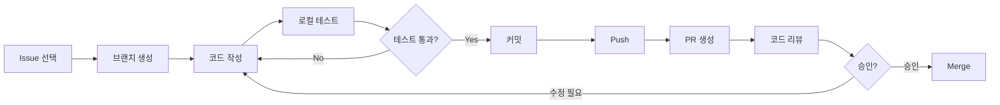

# 개발 가이드

> Last updated: 2025-10-18

Wedding Invitation 프로젝트 개발자를 위한 종합 가이드입니다.

## 📚 문서 목록

이 섹션에는 개발에 필요한 모든 가이드가 포함되어 있습니다.

| 문서 | 설명 | 대상 |
|------|------|------|
| [개발 환경 설정](./SETUP.md) | 로컬 개발 환경 구축 방법 | 신규 개발자 |
| [개발 워크플로우](./WORKFLOW.md) | Git 브랜치 전략 및 개발 프로세스 | 모든 개발자 |
| [코딩 컨벤션](./CONVENTIONS.md) | 코드 스타일 및 베스트 프랙티스 | 모든 개발자 |
| [테스트 가이드](./TESTING.md) | 테스트 작성 및 실행 방법 | 개발자 |
| [디버깅 가이드](./DEBUGGING.md) | 일반적인 문제 해결 방법 | 개발자 |

---

## 🚀 빠른 시작

### 신규 개발자 온보딩

프로젝트를 처음 접하시나요? 다음 순서로 진행하세요:

1. **환경 설정** (30분)
   - [개발 환경 설정](./SETUP.md) 문서를 따라 로컬 환경 구축
   - Node.js, Python, uv 설치
   - 의존성 설치 및 개발 서버 실행

2. **프로젝트 이해** (1시간)
   - [프로젝트 구조](../PROJECT_STRUCTURE.md) 문서로 코드베이스 파악
   - [README](../../README.md)에서 프로젝트 목적 및 기능 이해
   - 로컬에서 애플리케이션 실행해보기

3. **개발 프로세스 학습** (30분)
   - [개발 워크플로우](./WORKFLOW.md)에서 Git 브랜치 전략 학습
   - [코딩 컨벤션](./CONVENTIONS.md)에서 코드 스타일 숙지
   - [CONTRIBUTING](../../CONTRIBUTING.md)에서 기여 방법 확인

4. **첫 이슈 도전** (1-2시간)
   - GitHub Issues에서 `good first issue` 라벨 찾기
   - 작은 버그 수정 또는 문서 개선으로 시작
   - PR 생성 및 리뷰 프로세스 경험

**총 예상 시간: 3-4시간**

---

## 🛠️ 개발 환경

### 기술 스택

#### Frontend
- **Framework**: Next.js 14+ (App Router)
- **Language**: TypeScript
- **Styling**: Tailwind CSS
- **State**: React Hooks + Context API
- **Animation**: Framer Motion
- **Forms**: React Hook Form + Zod

#### Backend
- **Framework**: FastAPI
- **Language**: Python 3.11+
- **Database**: SQLAlchemy (PostgreSQL/SQLite)
- **Validation**: Pydantic
- **Migration**: Alembic
- **Package Manager**: uv

#### Testing
- **Frontend**: Jest + React Testing Library + Playwright
- **Backend**: pytest + httpx
- **E2E**: Playwright

#### DevOps
- **CI/CD**: GitHub Actions
- **Hosting**: Vercel (Frontend) + Railway (Backend)
- **Monitoring**: Sentry (에러 트래킹)

---

## 📝 개발 워크플로우

### 일반적인 개발 사이클



### 브랜치 전략 (Git Flow)

```
main (프로덕션)
  ↑
develop (개발 통합)
  ↑
feature/my-feature (기능 개발)
fix/bug-fix (버그 수정)
docs/update-readme (문서 업데이트)
```

자세한 내용은 [개발 워크플로우](./WORKFLOW.md)를 참고하세요.

---

## 🧪 테스트

### 테스트 실행

```bash
# Frontend 테스트
npm run test              # 단위 테스트
npm run test:watch        # watch 모드
npm run test:coverage     # 커버리지
npm run test:e2e          # E2E 테스트

# Backend 테스트
uv run pytest                    # 전체 테스트
uv run pytest tests/test_rsvp.py # 특정 파일
uv run pytest --cov=src tests/   # 커버리지
uv run pytest -v -s              # 상세 출력

# 전체 테스트
npm run test:all
```

### 테스트 작성 원칙

1. **단위 테스트**: 모든 함수/컴포넌트에 대해
2. **통합 테스트**: API 엔드포인트에 대해
3. **E2E 테스트**: 핵심 사용자 플로우에 대해

목표 커버리지: **80% 이상**

자세한 내용은 [테스트 가이드](./TESTING.md)를 참고하세요.

---

## 🎨 코드 품질

### Linting & Formatting

**Frontend:**
```bash
npm run lint              # ESLint 검사
npm run lint:fix          # 자동 수정
npm run format            # Prettier 포맷팅
npm run type-check        # TypeScript 타입 체크
```

**Backend:**
```bash
uv run ruff check .       # Linting
uv run ruff check --fix . # 자동 수정
uv run ruff format .      # 포맷팅
uv run mypy src/          # 타입 체크
```

### Pre-commit Hooks

프로젝트는 Husky를 사용하여 커밋 전 자동 검사를 수행합니다:

```bash
# 설치 (npm install 시 자동)
npm run prepare

# Hook이 실행하는 검사:
# 1. Lint 검사
# 2. 타입 체크
# 3. 포맷팅 검사
# 4. 유닛 테스트
```

---

## 🐛 디버깅

### Frontend 디버깅

**브라우저 DevTools:**
1. Chrome DevTools 열기 (F12)
2. Sources 탭에서 브레이크포인트 설정
3. Console에서 변수 확인

**VS Code 디버깅:**
`.vscode/launch.json` 설정 사용:
```bash
# F5 또는 "Run and Debug" 패널에서 시작
```

### Backend 디버깅

**Python Debugger (pdb):**
```python
# 코드에 브레이크포인트 추가
import pdb; pdb.set_trace()

# 또는 (Python 3.7+)
breakpoint()
```

**VS Code 디버깅:**
```bash
# F5 또는 "Run and Debug" 패널에서 "FastAPI" 설정 선택
```

자세한 내용은 [디버깅 가이드](./DEBUGGING.md)를 참고하세요.

---

## 📦 의존성 관리

### Frontend (npm)

```bash
# 패키지 추가
npm install <package-name>

# 개발 의존성 추가
npm install -D <package-name>

# 패키지 제거
npm uninstall <package-name>

# 의존성 업데이트
npm update

# 보안 취약점 검사
npm audit
npm audit fix
```

### Backend (uv)

```bash
# 패키지 추가
uv pip install <package-name>
uv pip freeze > requirements.txt

# 개발 의존성 추가
uv pip install <package-name>
# requirements-dev.txt에 수동 추가

# 패키지 제거
uv pip uninstall <package-name>

# 의존성 업데이트
uv pip install --upgrade <package-name>

# 전체 의존성 재설치
uv pip install -r requirements.txt --force-reinstall
```

---

## 🔒 보안

### 환경 변수

- **절대 커밋 금지**: `.env` 파일은 `.gitignore`에 포함
- **예시 파일 제공**: `.env.example`에 키 목록만 제공
- **로컬/프로덕션 분리**: 환경별 다른 값 사용

### 민감 정보 처리

```typescript
// ❌ Bad: 하드코딩
const apiKey = "sk_live_abc123";

// ✅ Good: 환경 변수
const apiKey = process.env.API_KEY;
```

```python
# ❌ Bad: 하드코딩
API_KEY = "sk_live_abc123"

# ✅ Good: 환경 변수
from os import getenv
API_KEY = getenv("API_KEY")
```

---

## 📊 성능 최적화

### Frontend 최적화

1. **이미지 최적화**
   - Next.js Image 컴포넌트 사용
   - WebP 포맷 사용
   - Lazy loading 적용

2. **코드 스플리팅**
   - Dynamic imports 사용
   - Route-based 스플리팅 (Next.js 자동)

3. **번들 크기 최적화**
   ```bash
   # 번들 분석
   npm run analyze
   ```

### Backend 최적화

1. **데이터베이스 쿼리**
   - N+1 쿼리 방지 (eager loading)
   - 인덱스 활용
   - 쿼리 최적화

2. **캐싱**
   - Redis 활용 (선택)
   - HTTP 캐싱 헤더

---

## 🤝 협업

### 코드 리뷰

**리뷰어로서:**
- 건설적인 피드백 제공
- 칭찬도 함께 (좋은 코드에 대해)
- 질문 형태로 제안

**작성자로서:**
- 작은 PR 유지 (< 400 lines)
- 명확한 설명 작성
- 피드백에 감사 표현

### 커뮤니케이션

- **GitHub Issues**: 버그 리포트, 기능 요청
- **GitHub Discussions**: 일반 논의, 질문
- **PR Comments**: 코드 리뷰
- **Commit Messages**: 변경사항 기록

---

## 📚 추가 리소스

### 학습 자료

**Frontend:**
- [Next.js 공식 문서](https://nextjs.org/docs)
- [React 공식 문서](https://react.dev/)
- [TypeScript Handbook](https://www.typescriptlang.org/docs/)
- [Tailwind CSS 문서](https://tailwindcss.com/docs)

**Backend:**
- [FastAPI 튜토리얼](https://fastapi.tiangolo.com/tutorial/)
- [SQLAlchemy 문서](https://docs.sqlalchemy.org/)
- [Pydantic 문서](https://docs.pydantic.dev/)

### 내부 문서

- [API 문서](../api/README.md)
- [컴포넌트 문서](../components/README.md)
- [디자인 시스템](../design/PRINCIPLES.md)
- [아키텍처 문서](../architecture/OVERVIEW.md)

---

## ❓ FAQ

**Q: 개발 서버가 느려요.**
A: Node.js와 Python 버전을 최신 LTS로 업데이트하세요. `node_modules`와 `.venv`를 삭제 후 재설치해보세요.

**Q: 테스트가 실패해요.**
A: 환경 변수가 올바르게 설정되었는지 확인하고, 데이터베이스를 초기화해보세요.

**Q: 어떤 이슈부터 시작해야 하나요?**
A: `good first issue` 라벨이 붙은 이슈를 추천합니다.

더 많은 FAQ는 [디버깅 가이드](./DEBUGGING.md)를 참고하세요.

---

**Navigation**: [Docs Home](../INDEX.md) | [README](../../README.md)
